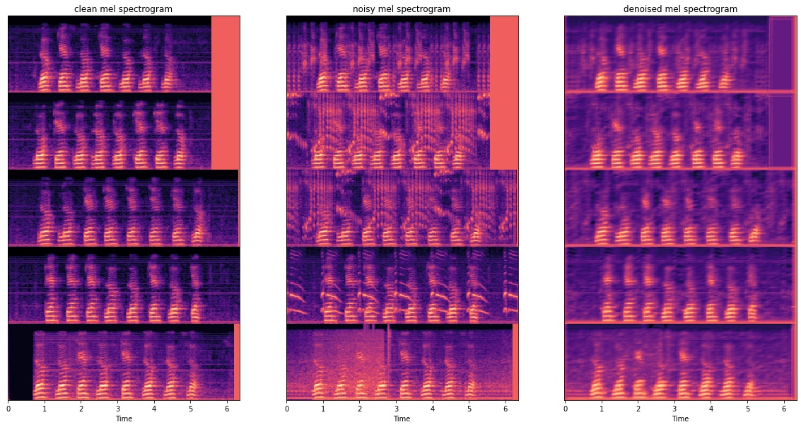
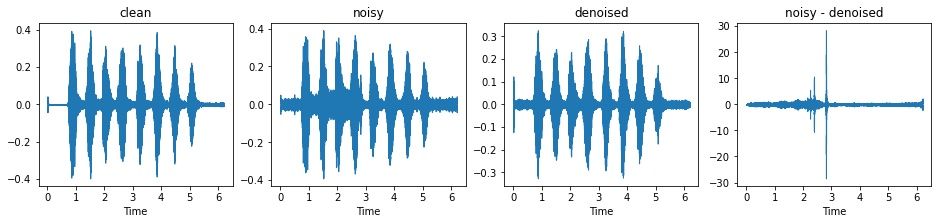
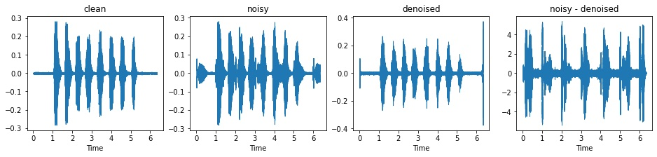
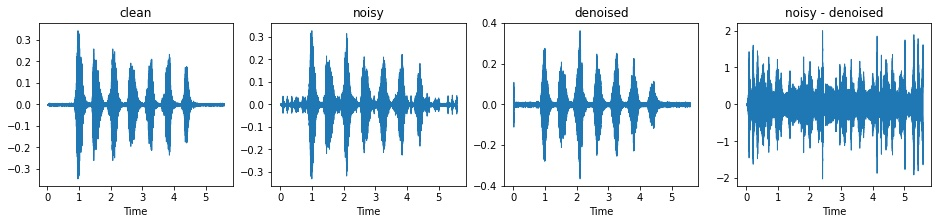

## Simple CAE(Convolutional Auto-Encoder) for Variable-Length Speech Denoising

## [Check notebook and Listen examples here](https://nbviewer.org/gist/hwang9u/c34b0f5751bc4adbf795551154f524ee)

<br>

### In this toyproject, I built **simplest** CAE(Convolutional Auto-Encoder) architecture for speech denoising.

<br>

## Model

### Encoder
* A stack of 3 encoder blocks.
* Since encdoer does not flatten the output, speech input with variable-length can be used.
* Encoder block: ```Conv2d -> BatchNorm2d -> LeakyReLU```

### Decoder

* A stack of 3 decoder blocks.
* Decoder block:  ```ConvTranspose2d -> LeakyReLU``` 
* Last decoder block contains only ```ConvTranspose2d```.

<br>

#### +) Loss function

* ```MaskedMSELoss```: **ignoring padding area in MSE loss computation.**

<br>

## Dataset

* Clean speech dataset: "YesNo" dataset(```torchaudio.datasets.yesno```)
* Noise signal: "noisesB" dataset ([Libri Speech Noise Datase](https://www.kaggle.com/datasets/earth16/libri-speech-noise-dataset/versions/2?resource=download&select=noisesB.7z))

* Noisy signal: clean speech signal + noise signal (with a specified SNR) <-- ```noisy.py```

<br>
<br>

## Examples(on Validation dataset)



<br>








